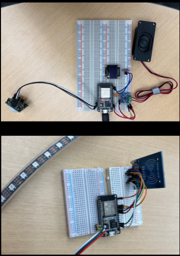
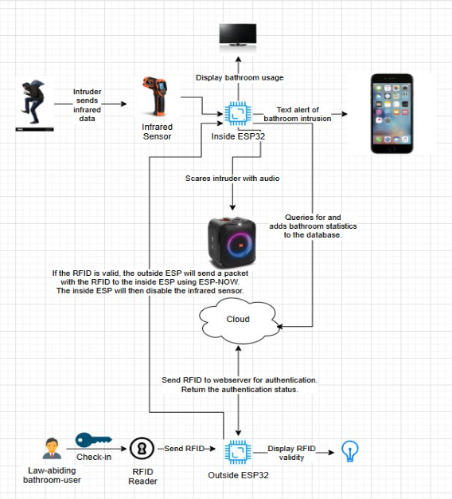

# Bathroom Bandits 🚻🚽  
**Flush Factory 🏭**  
*By: Caleb Lefcort, Arvand Marandi, Matt Nguyen*  

## 📖 Project Overview  
We built a security system for our home bathroom:  
- Controls bathroom entry using **RFID authentication**  
- Detects unauthorized individuals with an **infrared sensor**  
- Sounds an **alarm** upon unauthorized entry and sends a **text notification** to homeowners  

### ⚠️ Limitations & Assumptions  
- **Limitations:** Cannot use cameras in bathrooms, limiting intruder identification  
- **Assumptions:** Both ESP devices operate on the same Wi-Fi network  

---

## ✨ Project Features  
- Display bathroom **occupancy status** ✅  
- Record & display **bathroom usage metrics** ✅  
- Deter **unsanctioned bathroom use** ✅  
- Notify owners of **bathroom break-ins via SMS** ✅  
- Provide **visual feedback** on RFID scans ✅  

---

## 🔧 Hardware Components  
- RFID reader & tags  
- Infrared motion sensor  
- OLED display  
- Speaker  
- ESP microcontrollers  

---

## 🧠 Software Components  
- MySQL database for logging and metrics  
- ESP-NOW for device communication  
- HTTP requests for SMS notifications  
- Audio file processing for alarms  

---

## 🗂️ System Architecture (Four-Layer)  
**Perception Layer**  
- RFID reader & tags  
- Infrared motion sensor  

**Connectivity Layer**  
- ESP-NOW communication  
- HTTP requests for SMS alerts  

**Data Processing Layer**  
- MySQL database for usage metrics  

**Application Layer**  
- OLED display (occupancy indicator)  
- Speaker (audio alarms)  

---

## 🧪 Challenges  
- 🔊 **Audio Files Are Tricky:** Distortion issues with audio formats made alarm reliability difficult  
- 📶 **Wi-Fi Is Confusing:** Troubleshooting channels and connectivity consumed significant time  

---

## 🚨 Images 
  

